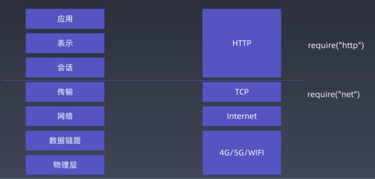
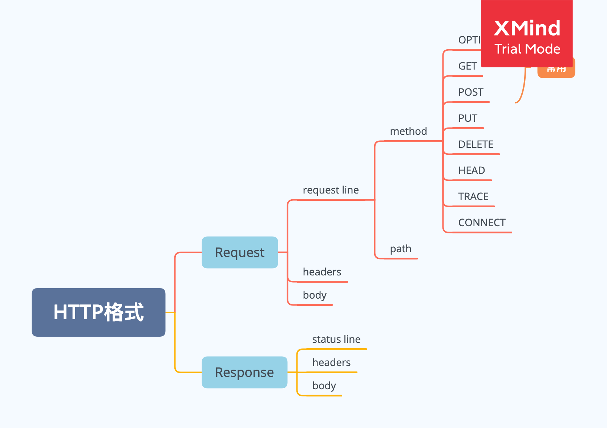

# 第五周

## 本周作业

1. 观看“浏览器工作原理 | HTTP 协议 + 语法与词法分析（二）”，根据老师课上讲解，完成课堂上的代码
   [client.js](./toy-browser/client.js)
   [server.js](./toy-browser/server.js)

## 本周学习总结

### 浏览器是如何工作的

### OSI 七层模型与 TCP/IP 四层模型对比

### HTTP 协议的结构

用 toy-browser 分析了 HTTP 协议的结构

HTTP 协议格式：

